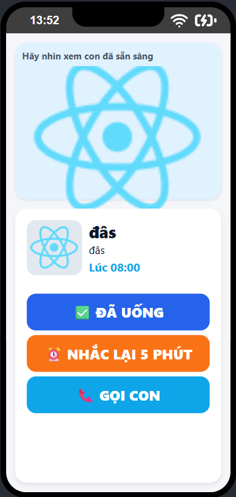
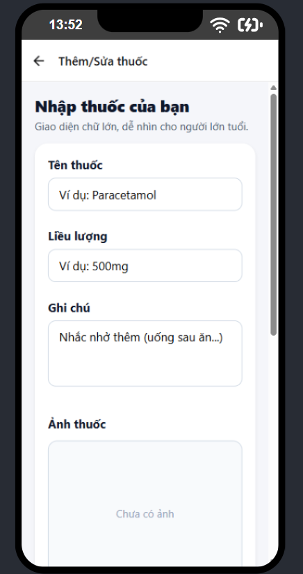
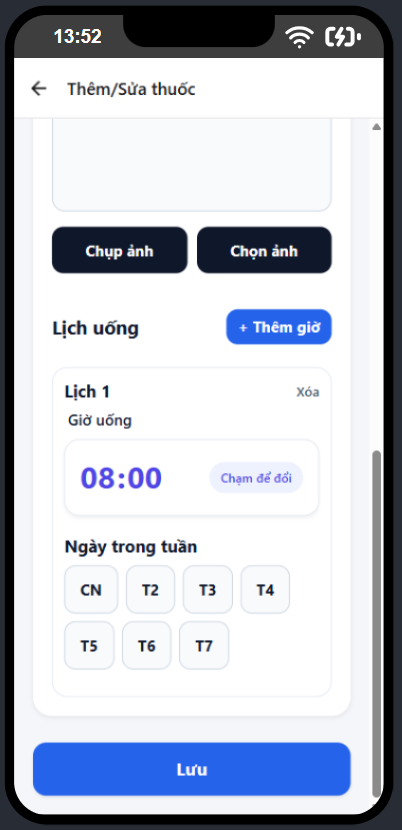

# Ứng dụng Nhắc Uống Thuốc (Tên Ứng Dụng Của Bạn) 💊

Một ứng dụng di động/web được thiết kế để giúp người dùng quản lý lịch trình uống thuốc, đảm bảo dùng thuốc đúng liều và đúng giờ.

---

## 📸 Ảnh Chụp Màn Hình (Screenshots)

Dưới đây là các ảnh chụp màn hình chính của ứng dụng để người dùng có cái nhìn trực quan về giao diện và chức năng.

### 1. Trang Chính (Home Screen)

Trang tổng quan hiển thị lịch uống thuốc sắp tới, trạng thái dùng thuốc trong ngày và các thông báo quan trọng.

### 2. Trang Nhắc Uống Thuốc (Medication Reminder Screen)

Màn hình chi tiết hiển thị danh sách các loại thuốc cần uống theo thời gian, cho phép người dùng đánh dấu đã uống.

### 3. Trang Nhập Thuốc - Bước 1 (Add Medication - Step 1)

Màn hình nhập thông tin cơ bản của thuốc (tên, liều lượng, tần suất).

### 4. Trang Nhập Thuốc - Bước 2 (Add Medication - Step 2)

Màn hình nhập chi tiết hơn về lịch trình (thời gian bắt đầu, số ngày dùng, các thời điểm cụ thể trong ngày).

---

## ✨ Tính Năng Nổi Bật

* **Quản lý Thuốc:** Thêm, chỉnh sửa và xóa thông tin thuốc dễ dàng.
* **Thông báo Thông minh:** Nhắc nhở uống thuốc đúng giờ, tránh quên hoặc dùng thuốc quá liều.
* **Theo dõi Lịch sử:** Ghi lại lịch sử dùng thuốc để theo dõi sự tuân thủ.

---

## 🛠 Hướng Dẫn Sử Dụng

(Bạn có thể thêm phần hướng dẫn cài đặt và sử dụng ứng dụng của mình tại đây.)

1. **Tải xuống và Cài đặt:** ...
2. **Thêm Thuốc:** ...

---

## 🧑‍💻 Tác Giả & Cộng Tác

* [Tên Của Bạn/Team] - [Liên kết đến Trang cá nhân/GitHub]